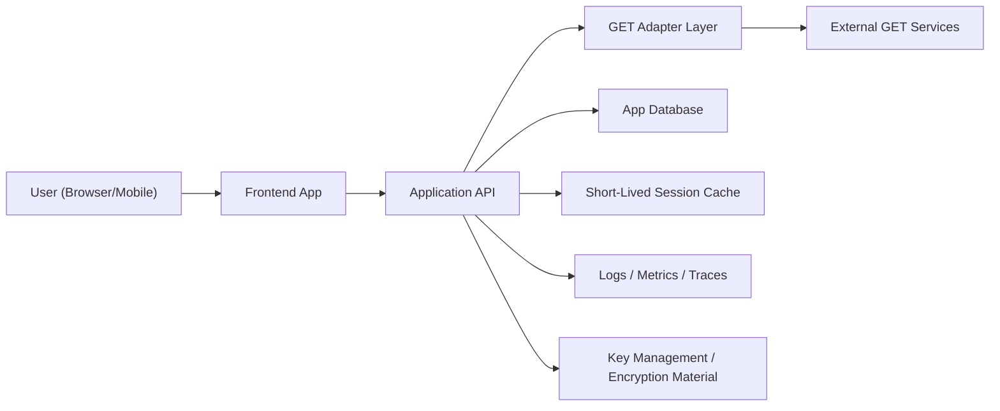
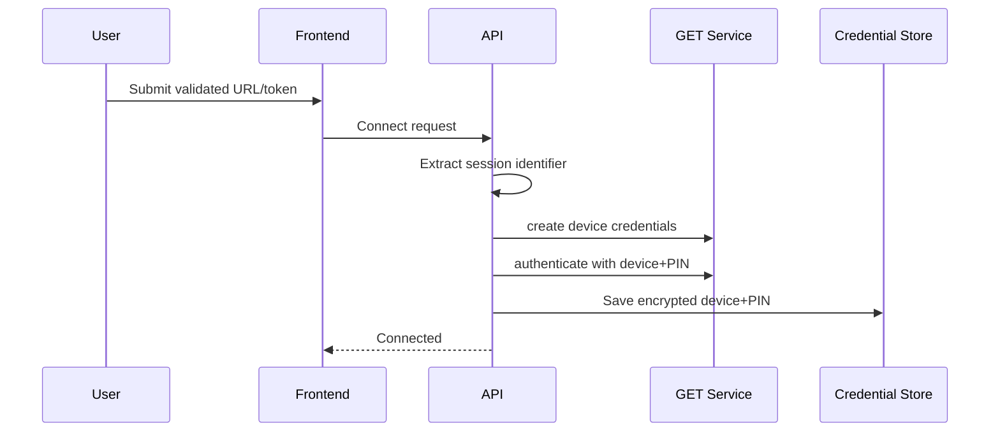
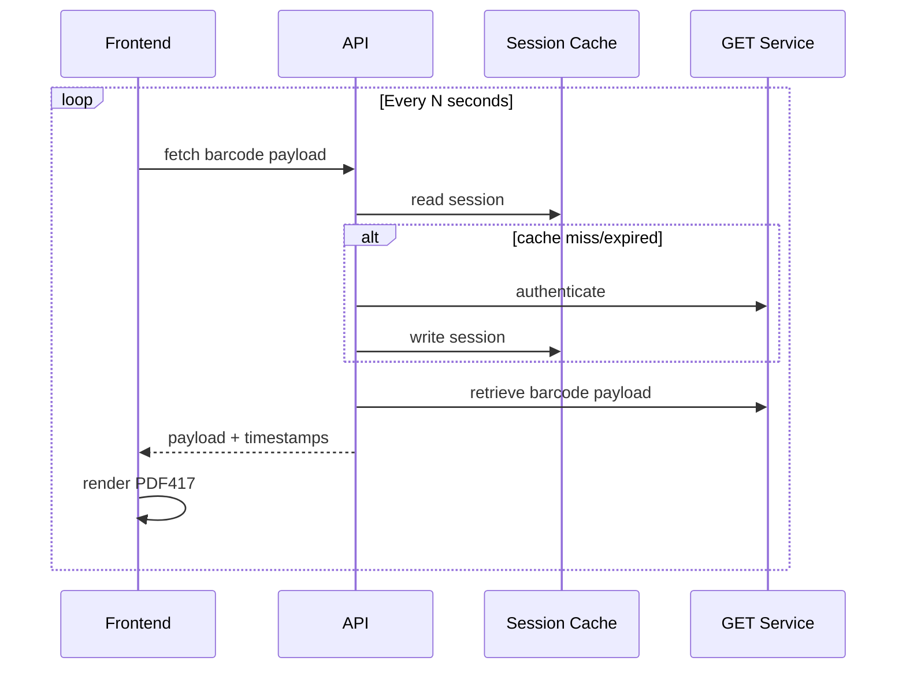
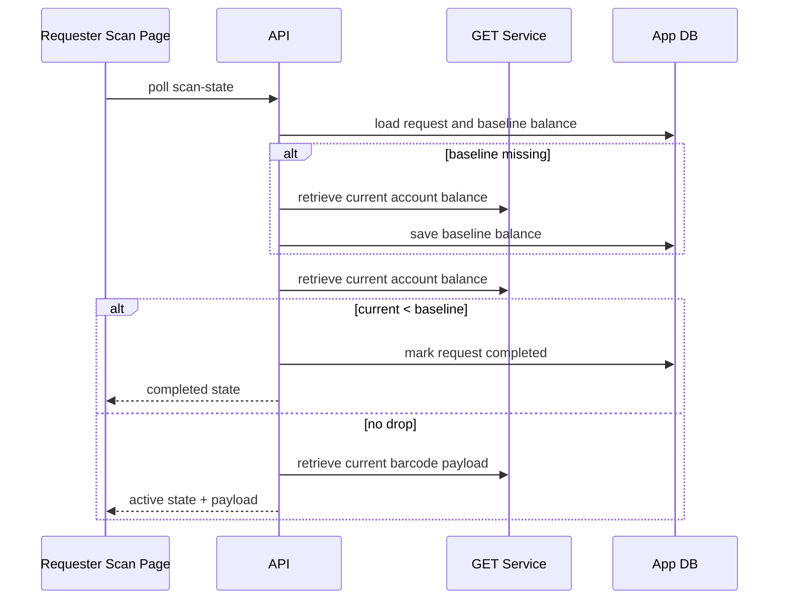

# GET Integration Architecture

Last updated: 2026-02-16

## 1. Scope

This architecture describes a system that:

- links a user’s GET account
- retrieves rotating barcode payloads
- renders PDF417 codes on the client
- marks requests fulfilled based on GET balance drop detection

This document is design-first and intentionally independent of any current implementation details.

## 2. Goals

- Reliable barcode retrieval with predictable latency.
- Secure handling of GET credentials and sessions.
- Clear separation between demo and production modes.
- Observable, debuggable behavior across auth, payload, and completion flows.

## 3. Non-Goals

- Replacing GET’s auth model with OAuth/JWT.
- Offline barcode generation independent of GET.
- Permanent anonymous access to production APIs.

## 4. High-Level Architecture

## 5. Logical Components

## Frontend App

- Inputs for account linking (validated URL/token).
- Scan page that polls scan-state and renders PDF417.
- Testing page for diagnostics and controlled demos.

## Application API

- Owns all authorization and business rules.
- Provides stable app-level endpoints.
- Converts app requests into GET adapter calls.

## GET Adapter Layer

- Wraps external GET RPC-style methods.
- Handles envelope parsing, error normalization, and retries.
- Shields the rest of the system from upstream contract drift.

## Credential Store

- Stores encrypted device credentials for linked users.
- Maintains metadata like last validation timestamp.

## Session Cache

- Short-lived cache for GET session tokens.
- Reduces repeated authenticate calls.

## Observability Stack

- Centralized logs, metrics, traces, and alerting.

## 6. Data Model (Conceptual)

## User

- identity fields
- default fulfillment mode

## Request

- requester and donor linkage
- requested amount/location
- fulfillment mode
- code issue/expiry timestamps
- baseline balance snapshot at first code display
- completion timestamp and trigger reason

## GetCredential

- encrypted device ID
- encrypted PIN
- last validation timestamp

## Notification

- request lifecycle messages for users

## 7. Core Workflows

## A) Account Linking

## B) Barcode Refresh

## C) Fulfillment Completion

## 8. Security Architecture

## Secret handling

- Keep all GET credentials and sessions server-side only.
- Encrypt stored credentials with authenticated encryption.
- Isolate encryption material from application code.

## Access control

- Production flows require authenticated app users.
- Scan-state must enforce requester ownership.
- Donor-only actions enforced server-side.

## Demo controls

- Demo auth inputs (session/device headers) are feature-gated.
- Demo mode is disabled in production environments by default.

## Auditability

- Log auth source and high-level outcome only.
- Never log raw device IDs, PINs, or session tokens.

## 9. Reliability Architecture

## Upstream fault handling

- Distinguish transient vs non-transient errors.
- Retry transient failures with bounded backoff.
- Fail fast for invalid credentials and malformed requests.

## Idempotency and race safety

- Use transactional updates for transfer + request state changes.
- Guard completion transition to avoid duplicate completions.

## Expiry and timing

- Track code issue and expiry timestamps in server time.
- Capture baseline balance on first successful scan-state activation.
- Compare only against balances from the same account scope.

## 10. API Contracts (Abstract)

## Response state machine for scan-state

- `active`: payload available for rendering
- `completed`: request finalized
- `unavailable`: not accepted, wrong mode, or linking/auth issue

## Standard error envelope

- machine-readable `code`
- human-readable `message`
- optional `details` and `retryable`

## 11. Deployment Considerations

## Single instance

- In-memory session cache is acceptable for low traffic demos.

## Multi-instance / serverless

- Move session cache to shared store if cache hit rate matters.
- Ensure all instances have access to same key material source.

## Environments

- Separate feature flags for:
  - GET fulfillment
  - testing lab/demo paths

## 12. Observability and SLOs

Suggested SLOs:

- barcode payload fetch success rate >= 99%
- P95 payload fetch latency <= 1.5s
- auth failure rate below agreed threshold
- completion detection delay <= agreed polling window

Key metrics:

- GET method latency and error counts by method
- retry attempts and exhaustion count
- scan-state distribution (active/completed/unavailable)
- fulfillment completion lag

## 13. Risks and Mitigations

- Upstream API contract changes
  - Mitigation: adapter boundary + contract tests
- False completion due to unrelated balance drops
  - Mitigation: narrow account scope and apply guardrails (minimum delta, short validity window, optional confirmation checks)
- Secret leakage via logs/client
  - Mitigation: redaction, server-only calls, secret scanning
- Demo path accidentally exposed in production
  - Mitigation: explicit feature gates + CI environment checks

## 14. Rollout Plan

1. Ship adapter and diagnostics in staging.
2. Validate account linking with test accounts.
3. Enable barcode retrieval for internal users.
4. Enable completion automation with shadow verification.
5. Gradually enable for broader traffic.
6. Keep rollback path via feature flags.

## 15. Architecture Decisions Summary

- Use server-side GET adapter abstraction.
- Use encrypted at-rest credential storage.
- Use short-lived session caching.
- Use polling-based scan-state and balance-drop completion checks.
- Keep demo and production auth paths explicitly separated.
